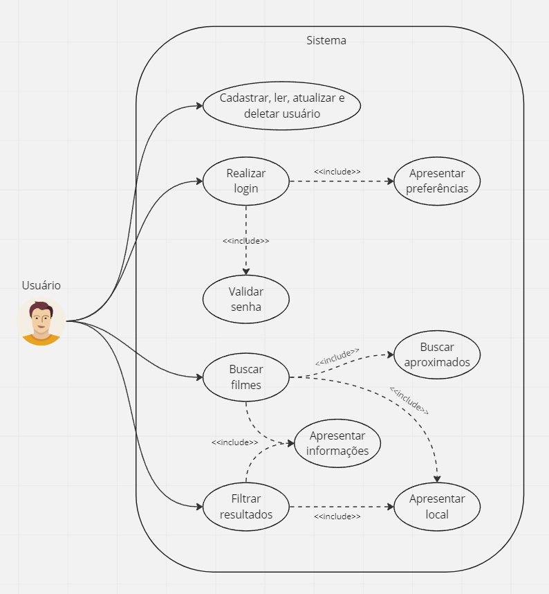

# Especificações do Projeto

As personas levantadas durante o processo de entendimento do problema são apresentadas nas Figuras que se seguem:

## Personas

### Pedro Mendes:
* <b>Idade:</b> 30 anos. 
* <b>Ocupação</b>: Engenheiro e microempreendedor no ramo de roupas esportivas.
* <b>Residência</b>: BH - MG
* <b>Forma de escolha do que assistir</b>: Indicações de amigos; notas e comentários em sites
* <b>Frustrações</b>: Perda de tempo com a procura de filmes, series, animes e documentários pra assistir, ou em qual plataforma está o produto.
* <b>Streaming Utilizado</b>:
  - Netflix 
  - AmazonPrime 
  - WhatsApp 
  - HBO Max 

### Lucas Hipolito
* <b>Idade:</b> 32 anos. 
* <b>Ocupação</b>: Trader-Esportivo
* <b>Residência</b>: BH - MG
* <b>Forma de escolha do que assistir</b>: Baseado em propagandas mostradas em jogos, videos e plataformas como Facebook.
* <b>Frustrações</b>: Não ter como Favoritar aquiles filmes, séries e documentários que gostei de assistir.
* <b>Streaming Utilizado</b>:
  - Netflix 

### Daniela Lanna
* <b>Idade:</b> 29 anos
* <b>Ocupação</b>: Médica
* <b>Residência</b>: BH - MG
* <b>Forma de escolha do que assistir</b>: Recomendações de pessoas com gostos similares; notas e comentários de sites especializados.
* <b>Frustrações</b>: Os layout dos app de pesquisa são ruins, não consigo configurar minhas preferências como, idioma ou selecionar o episódio que quero assistir.
* <b>Streaming Utilizado</b>:
  - Netflix 
  - Discovery
  - Crunchyroll
  - HboMax
  - Star+
  - AmazonPrime
  

### Nicollas Ardigo De Mello
* <b>Idade:</b> 21 anos
* <b>Ocupação</b>: Ciências da Computação
* <b>Residência</b>: Itopava Norte - BC/SC
* <b>Forma de escolha do que assistir</b>: Filmes que possuem notas iguais ou superiores a 70% de aprovação ou que tenham pelo menos avaliação 7/10.
* <b>Frustrações</b>: Tenho dificuldades para encontrar filmes com 70% de aprovação ou cujo as notas sejam 7/10.
Os filtros de sites especializados em pesquisa de filmes, séries e documentários  possuem carência de informação para melhorar a pesquisa.
* <b>Streaming Utilizado</b>:
  - Netflix 
  - HboMax

## Histórias de Usuários

A partir da compreensão do dia a dia das personas identificadas para o projeto, foram registradas as seguintes histórias de usuários:

|EU COMO... `PERSONA`| QUERO/PRECISO ... `FUNCIONALIDADE` |PARA ... `MOTIVO/VALOR`                 |
|--------------------|------------------------------------|----------------------------------------|
|<b>Pedro Mendes</b>  | Otimizar o tempo de procura de filmes e séries entre as diversas streams | Poupar tempo com a procura com o conteúdo que quero assistir                |
|<b>Daniela Lanna</b>  | Organizar/personalizar os meus meios de pesquisa de forma que a pesquisa seja fácil | Os layouts das plataformas de streaming por vezes são desnecessariamente complicadas e confusas               |
|<b>Daniela Lanna</b>  | Desejo saber em qual plataforma de streaming eu preciso acessar especificamente para consumir o conteúdo que desejo. | Assino várias plataformas de Streaming e quando quero procurar o que assistir preciso acessar plataforma por plataforma|
|<b>Nicollas Ardigo De Mello</b>  | Uma plataforma de procura que demonstre as notas dos principais sites de crítica especializada em cinema, séries e documentários | Escolho os conteúdos que vou assistir baseando em suas notas em sites especializados               |
|<b>Lucas Hipolito</b>  | Ter um botão de favoritos e uma lista que demonstre os conteúdos  selecionados. |Ter a possibilidade de favoritar e ter uma lista dos documentários que gostei e quero assistir novamente ou mostrar à alguém               |

## Requisitos

Os requisitos do projeto descrevem a maneira de interação dos usuários com o sistema, mostrando quais serão as funcionalidades disponíveis e os aspectos não funcionais para garantir a usabilidade. Além disso, para o desenvolvimento do sistema, são observadas restrições. A seguir, são descritos estes tópicos:

### Requisitos Funcionais

|ID    | Descrição do Requisito  | Prioridade |
|------|-----------------------------------------|----|
|RF-001| A aplicação deve permitir que o usuário faça a busca desejada. | ALTA | 
|RF-002| A aplicação deve exibir resultados relacionados às palavras buscadas | ALTA |
|RF-003| A aplicação deve conter filtros para auxiliar na busca do conteúdo pesquisado. | ALTA |
|RF-004| A aplicação deve exibir em qual plataforma de streaming o conteúdo desejado se encontra disponível para exibição. | ALTA |
|RF-005| A aplicação deve exibir informações como notas dos principais sites agregadores de crítica, duração total, gênero e outras informações relacionadas. | ALTA |
|RF-006| A aplicação deve sugerir conteúdos relacionados às buscas já realizadas anteriormente e faviritar conteúdos. | MÉDIA |
|RF-007| A aplicação deve permitir ao usuário cadastrar, ler, atualizar e excluir suas informações de cadastro. | MÉDIA |
|RF-008| A aplicação deve permitir ao usuário realizar login na plataforma. | MÉDIA |
|RF-009| A aplicação deve realizar a verificação de login de usuário na plataforma. | MÉDIA |

### Requisitos não Funcionais

|ID     | Descrição do Requisito  |Prioridade |
|-------|-------------------------|----|
|RNF-001| A aplicação deve permitir que o usuário opte por vincular sua conta Google à aplicação ou utilizá-la de forma pontual e sem criação de vínculo. | MÉDIA | 
|RNF-002| A aplicação deve permitir que o usuário, ao vincular sua conta Google à aplicação, tenha acesso a um perfil com preferências personalizáveis. |  MÉDIA | 
|RNF-003| A aplicação deve ser publicada em um ambiente acessível publicamente na Internet (GitHub Pages…). |  ALTA | 
|RNF-004| A aplicação deverá ser responsiva permitindo a visualização em um celular de forma adequada. |  ALTA |
|RNF-005| A aplicação deve ter bom nível de contraste entre os elementos da tela em conformidade. |  MÉDIA |
|RNF-006| A aplicação deve ser compatível com os principais navegadores do mercado (Google Chrome, Firefox, Microsoft Edge). |  ALTA |
|RNF-007| A aplicação deve retornar resultados equivalentes nos idiomas português e inglês. |  BAIXA |

## Restrições

A tabela a seguir indica as restrições para o desenvolvimento e realização do projeto:

|ID| Restrição                                             |
|--|-------------------------------------------------------|
|RE-01| O projeto deve ser entregue até o final do semestre 2023.1 |
|RE-02| O projeto não possui orçamento definido. |
|RE-03| Apenas a própria equipe será responsável pelo desenvolvimento do projeto. |
|RE-04| O projeto fará uso de um banco de dados relacional. |

## Diagrama de Casos de Uso

## Backlog e Plano de Sprints

A equipe definiu a ferramenta Trello como plataforma para o gerenciamento de projeto e organização e distribuição de tarefas.

[Trello - MovieFinder](https://trello.com/invite/b/8tOr5q9j/ATTIeae19eb8d4a66751c9411544031a3d815E47F8FA/kanban-moviefinder)
