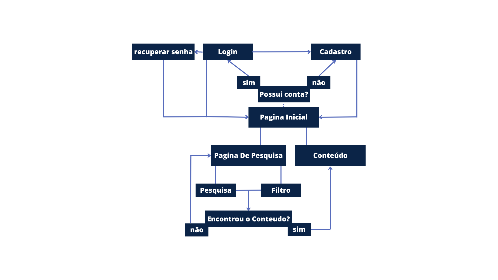

# Projeto de Interface

Pré-requisitos: <a href="2-Especificação do Projeto.md"> Documentação de Especificação</a>

Visão geral da interação do usuário pelas telas do sistema e protótipo interativo das telas com as funcionalidades que fazem parte do sistema (wireframes).

 Apresente as principais interfaces da plataforma. Discuta como ela foi elaborada de forma a atender os requisitos funcionais, não funcionais e histórias de usuário abordados nas <a href="2-Especificação do Projeto.md"> Documentação de Especificação</a>.

## Diagrama de Fluxo

O diagrama apresenta o estudo do fluxo de interação do usuário com o sistema interativo e  muitas vezes sem a necessidade do desenho do design das telas da interface. Isso permite que o design das interações seja bem planejado e gere impacto na qualidade no design do wireframe interativo que será desenvolvido logo em seguida.

Imagem representativa do diagrama de fluxo do  grupo.

## Wireframes

São protótipos usados em design de interface para sugerir a estrutura de um site web e seu relacionamentos entre suas páginas. Um wireframe web é uma ilustração semelhante do layout de elementos fundamentais na interface. Este Wireframe foi desenvolvido na platarfoma Figma e pode ser acessado no link abaixo:

>- **Wireframe interativo:** https://www.figma.com/proto/JXw8sb2Mel2HxeeXTsDaMU/Wireframes?page-id=0%3A1&node-id=11-188&viewport=358%2C329%2C0.36&scaling=scale-down&starting-point-node-id=11%3A188

### Página Principal

### Página de Busca

### Página de Resultado

### Página de Cadastro

### Página de Login

### Página de Recuperação de senha

