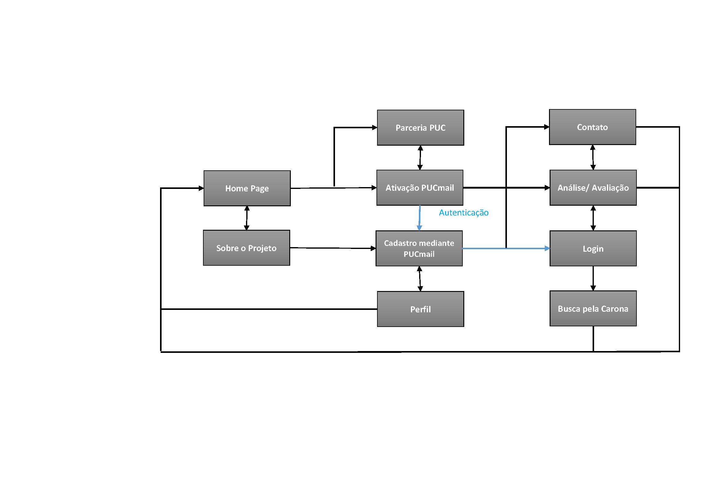
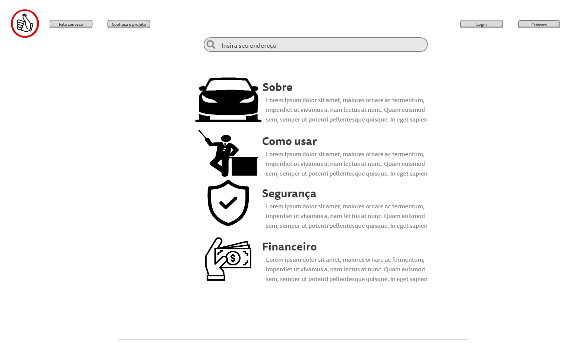
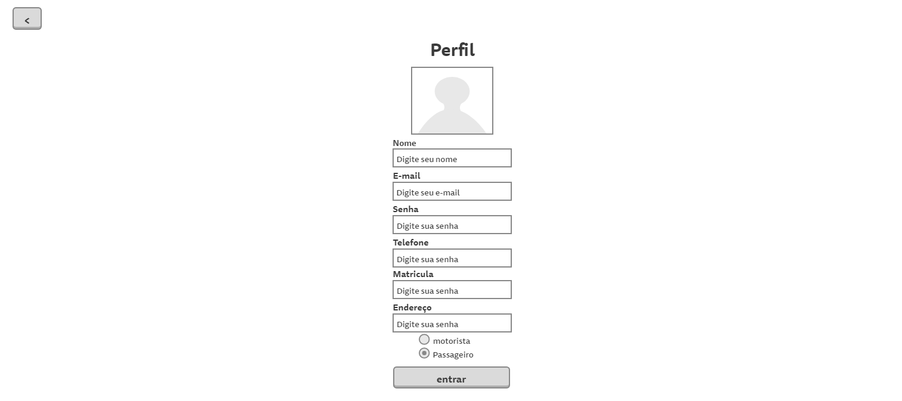
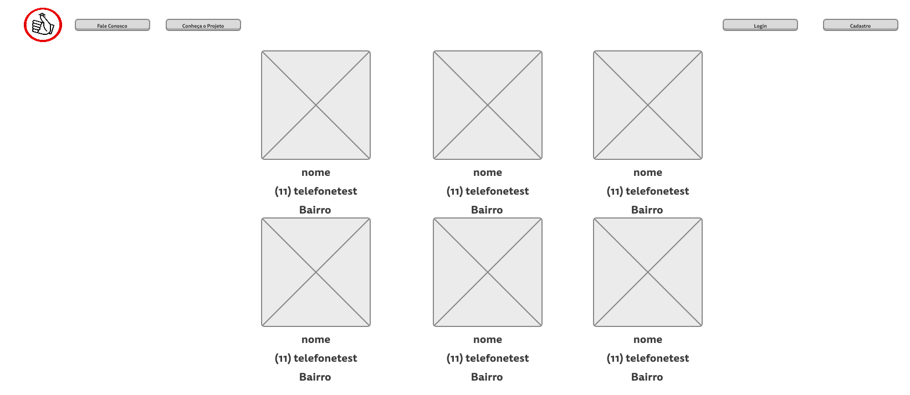

# Projeto de Interface

Dentre as preocupações para a montagem da interface do sistema, estamos estabelecendo foco em questões como agilidade, acessibilidade e usabilidade. Desta forma, o projeto tem uma identidade visual padronizada em todas as telas que são projetadas para funcionamento em desktops e dispositivos móveis.

## User Flow

## Fluxo do Usuário
O diagrama apresentado na Figura X mostra o fluxo de interação do usuário pelas telas do sistema. 

## Wireframes

## Tela – Home-Page
Na tela home-page ira ter uma apresentação do site e também muitas de suas funcionalidades, observe a imagem a seguir.

## Tela – Perfil do Usuário
Na tela “Perfil do Usuário” é apresentado os dados pessoais enviados pelo usuário após o cadastro. Ao clicar na logo o usuário pode retornar a página principal. Clicando no botão de “alterar a imagem”, o usuário poderá colocar uma foto de perfil, que pode ser trocada quando bem desejar. Clicando no botão “Alterar” do lado de dados pessoais, será levado a uma página onde sua senha será pedida para que possa alterar seus dados pessoais. E clicando no botão de “Excluir Conta”, o usuário será levado a uma página que irá pedir sua senha, feito o procedimento outra página vai se abrir o permitindo excluir seu cadastro.

## Tela - Cadastro
A tela de cadastro de Usuário apresenta as especificações representadas na imagem a seguir

## Tela - Login
A tela de login de Usuário apresenta as especificações representadas na imagem a seguir

## Tela - Resultado de busca
A tela de Resultado de busca apresenta as especificações representadas na imagem a seguir

