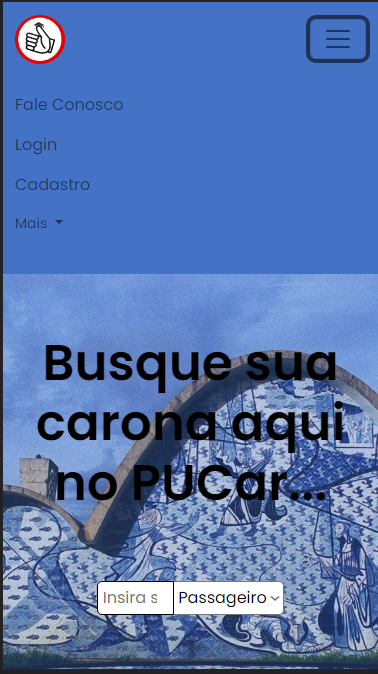

# Registro de Testes de Software

Os resultados obtidos nos testes de software realizados são descritos abaixo.

## Home Page

### CT – 01 – Home page – Conheça o Projeto

A página vai se mover para baixo, apresentando como utilizar a pesquisa de caronas.

Após clicar em como utilizar:

### CT- 02 - Home page – Navegabilidade - Cadastro

A página de cadastro é aberta.

Após clicar em cadastro:

### CT- 03 – Home page - Navegabilidade -Login

A página de login é aberta.

Após clicar em login:

### CT- 04 - Home page - Navegabilidade - Fale Conosco

A página vai se mover para baixo até seu final, mostrando os contatos dos desenvolvedores.

Após clicar em fale conosco:

### CT- 05 – Home page - Responsividade

Tela "Iphone SE": 

### CT- 06 – Home page – Filtro de pesquisa - Passageiros

A pesquisa deve mostrar apenas contas de passageiros no bairro digitado.

### CT- 07 – Home page – Filtro de pesquisa - Motorista

A pesquisa deve mostrar apenas contas de motoristas no bairro digitado.

### CT- 08 – Home page – Pesquisa – Teste de Campo

Foi apenas escrito com letras, deve aparecer os usuários do bairro.

### CT- 09 – Home page – Navegabilidade - Perfil

O botão deve levar o usuário a página de perfil.

Após clicar em perfil:

### CT- 10 – Home page – Navegabilidade - Sair

O usuário sairá da sua conta cadastrada.

Após clicar em sair:

## Resultado de Busca

### CT-11 - Resultado de Busca - Conheça o projeto 

Após clicar no menu "Conheça o Projeto" - "Como utilizar" a página será redirecionar para Home-Page, apresentando como utilizar a pesquisa de caronas.

Após clicar em "Como utilizar":

### CT- 12 – Resultado de busca – Navegabilidade - Perfil

Clicando no botão "Perfil" o usuário será direcionado para a página.

Após clicar em "Perfil".

### CT- 13 – CT-04 – Resultado de busca – Navegabilidade - Sair

Clicando no botão "Sair", o usuário será direcionado para a "Home Page" e sairá da sua conta cadastrada.

Após clicar em "Sair".

### CT- 14 – Resultado de busca - Navegabilidade - Fale Conosco

Clicando no botão "Fale Conosco" o usuário será direcionado para o fim dá pagina que exibirá os contatos dos desenvolvedores.

Após clicar em "Fale Conosco"

### CT- 15 – Resultado de busca - Responsividade

Ao utilizar a aplicação em dispositivos móveis, a página se adaptará para exibir as informações de forma responsiva.

### CT- 16 – Resultado de busca – Pesquisa

Clicando na barra de busca, ao digitar o bairro e selecionar "motorista" ou "passageiro" usuário recebe o contato de motoristas ou passageiros presentes no bairro digitado.

Após clicar na barra de busca, digitar o bairro, selecionar "Motorista" e "enter".

Após clicar na barra de busca, digitar o bairro, selecionar "Passageiro" e "enter".

### CT- 17 – Resultado de busca – Pesquisa – Teste de Campo

O campo de busca só aceita texto, quando digitado número não busca a informação.

Após digitar texto no campo de busca na opção "Motorista".

Após digitar texto no campo de busca na opção "Passageiro".

## Cadastro

### CT- 18 – Cadastro - Campo Nome

Deve ser apresentado um alerta informando que o campo "Nome" não aceita números e caracteres especiais.

Após digitar número no campo "Nome".

### CT- 19 – Cadastro - Campo E-mail

Ao digitar um e-mail diferente do puc-mail, deve ser apresentado um alerta informando que somente e-mails da universidade PUC serão aceitos

Após digitar um e-mail diferente do puc-mail

### CT- 20 – Cadastro - Campo Senha

Ao digitar a senha, se tiver menos de 8 caracteres, deve ser apresentado um alerta informando que a senha deve ter ao menos 8 caracteres.

Ao digitar a senha com menos de 8 caracteres.

### CT- 21 – Cadastro - Confirmar senha

Ao digitar senhas diferentes, deve ser apresentado um alerta informando que as senhas não coincidem

Ao digitar as senhas diferentes.

### CT- 22 – Cadastro - Matrícula

Ao digitar letras e caracteres especiais, deve ser apresentado um alerta informando que a matrícula deve conter apenas números.

Ao digitar letras e caracteres especiais.

### CT- 23 – Cadastro - Campo de Telefone

Ao digitar letras e caracteres especiais, deve ser apresentado um alerta informando que o telefone deve conter apenas números.

Ao digitar letras e caracteres especiais.

### CT- 24 – Cadastro - Bairro

Ao digitar letras e carcteres especiais, deve ser apresentado um alerta informando que o bairro deve conter apenas letras.

Ao digitar letras e caracteres especiais.

### CT- 25 – Cadastro - Campos Vazios

Ao preencher todos os campos, o usuário será direcionado para a tela de "Login"

Se faltar o preenchimento de algum campo será apresentado uma mensagem indicando qual campo falta ser preenchido.

## Login

### CT- 26 – Área Logada – Navegabilidade – Login

Clicando no botão "Login" na página "Home Page" o usuário será direcionado para a página de "Login"

Após clicar no botão "Login"

### CT 27 - Área Logada - Navegabilidade - Botão "Entrar"

Clicar no botão "Entrar" ao digitar o puc-mail e senha, o usuário será direcionado para a páginal de "Home Page" área logada.

Ao digitar usuário e senha e clicar no botão "Entrar"

### CT- 28 – Área Logada - Navegabilidade – Link “Cadastre-se”

Caso não tenha se cadastrado na aplicação, clicar no link "Cadastre-se"

Após clicar em "Cadastre-se", o usuário será direcionado para a página de "Cadastro".

### CT- 29 – Área Logada - Navegabilidade – Botão Voltar

Ao clicar no botão "Voltar" representado pela seta, o usuário será direcionado a "Home Page"

Após clicar no botão "Voltar"

### CT- 30 – “Login” – Responsividade

Ao utilizar a aplicação em dispositivos móveis, a página se adaptará para exibir as informações de forma responsiva.

### CT- 31 – E-mail – Teste de Campos de Formulários

Digitar e-mail cadastrado.

### CT-32 - Senha - Teste de Campo de Formulários
Digitar senha deve conter no mínimo 8 caracteres.

Após digitar o e-mail e senha, clicar no botão "Entrar" o usuário será direcionado para a páginal de "Home Page" área logada.

## Perfil

### CT- 33 – Perfil – Atualização da foto de perfil

Antes:

Atualizado:

Teste efetuado com sucesso!

### CT- 34 – Perfil – Atualização da senha

Antes:

Atualizado:

Teste Efetuado com sucesso!

### CT- 35 – Perfil – Atualização do número telefônico

Antes:

Atualizado:

Teste efetuado com sucesso!

### CT- 36 – Perfil – Atualização do endereço do usuário

Antes:

Atualizado:

Teste efetuado com sucesso!

### CT- 37 – Perfil – Desativação de conta

Antes:

Ao clicar no botão de desativação:

Clicando no botão de "ok" no pop up:

Teste efetuado com sucesso!
